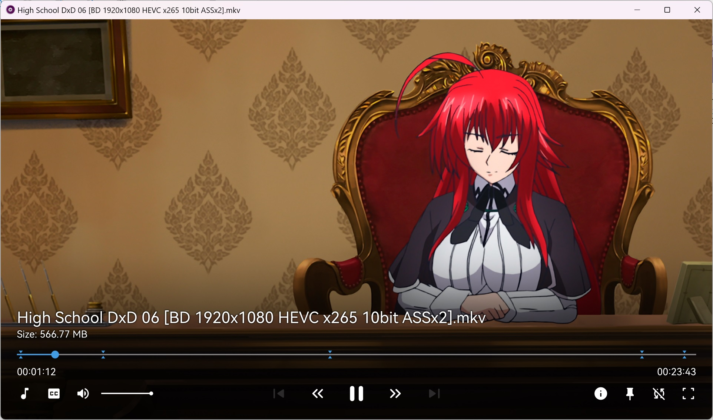

# ModernX
>
> This repo forked from [zydezu/ModernX](https://github.com/zydezu/ModernX).
> 
> To configurate, see [zydezu/ModernX](https://github.com/zydezu/ModernX) README for more imformation.
>

## What's Difference

- Remove snack bar auto hide
- Change icon to Material Symbol
- Change font to Harmony OS SC
- Adjust font size and icon size

## Installation

Locate your MPV folder. It is typically located at `\%APPDATA%\mpv\` on Windows and `~/.config/mpv/` on Linux/MacOS. See the [Files section](https://mpv.io/manual/master/#files) in mpv's manual for more info.

> [!NOTE]
> Create these folders if you don't have them already

Place `modernx.lua` into your mpv `scripts/` folder, remove any previous OSC scripts.

Then place the two fonts in the `fonts/` folder. 
